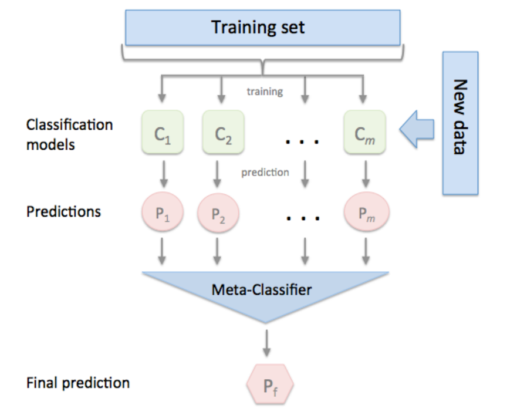

# Ensemble Model

- Predict Y-value by voting or referring `multiple model` not the using only "one" model.

- Predict average value in regression problem.

- meta-classifier

- developed to stacking (meta-ensemble)

- performance is good. Time cost of learning is bad.

- Many Kaggle user use this method

### Let's learn about below

- Vanilla ensemble

- Boosting

- Bagging

- AdaBoost (Adaptive boosting)

- XGBoost

- Light GBM